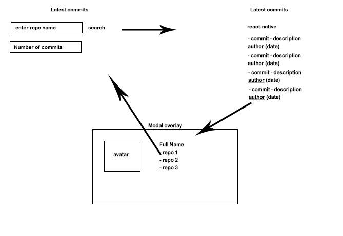

# Task

# APIs

You will be using Github api in order to complete this task. Please use this [documentation](https://developer.github.com/v3/repos/commits/).

# Scripts

This project was bootstrapped with [Create React App](https://github.com/facebook/create-react-app).

### `yarn install`

This will set up everything you need in order to be able to run the application.

### `yarn start`

Runs the app in the development mode.\
Open [http://localhost:3000](http://localhost:3000) to view it in the browser.

The page will reload if you make edits.\
You will also see any lint errors in the console.
