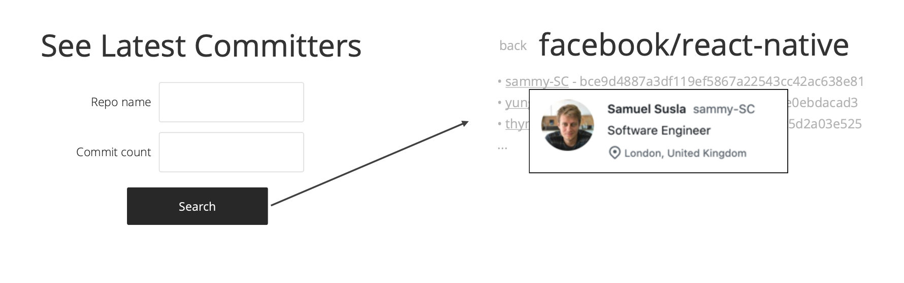

# Task

## View 1
- User can interact with 2 form fields to enter the appropriate values
- Entered values into the commit count field should be either a number, or set to a default value
- Upon hitting `Search`, the user is taken to [View 2](#view-2)

## View 2
- `back` button takes the user back to [View 1](#view-1)
- the title shows you the repo that you are investigating
- display the number of commits that was requested, as a list
- each list item contains the author's username and the commit hash
- when a user hovers over an author's name, a small overlay with additional information is displayed to the user, including their avatar, name, bio, and location

# APIs

You will be using Github api in order to complete this task. Please use this [documentation](https://developer.github.com/v3/repos/commits/).

# Scripts

This project was bootstrapped with [Create React App](https://github.com/facebook/create-react-app).

### `yarn install`

This will set up everything you need in order to be able to run the application.

### `yarn start`

Runs the app in the development mode.\
Open [http://localhost:3000](http://localhost:3000) to view it in the browser.

The page will reload if you make edits.\
You will also see any lint errors in the console.
